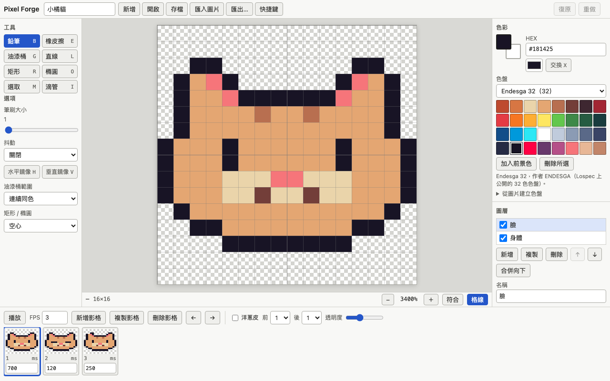

# Pixel Forge
A zero-dependency pixel art and animation editor that runs entirely in your browser.

Pixel Forge 是一個在瀏覽器裡執行的像素畫與動畫編輯器。純靜態網頁、不用安裝任何套件、不需要建置，連 GIF 編碼器都是自己寫的。

**線上試用：<https://useless-husband.github.io/pixel-forge/>**



## 功能

**畫布**
- 自訂尺寸 8–256，滾輪或雙指縮放，空白鍵拖曳（或中鍵、雙指）平移
- 格線開關、棋盤格透明背景
- 快速拖曳也不會漏點（相鄰取樣點之間用 Bresenham 補線）

**工具**（括號內為快捷鍵）
- 鉛筆 (B)、橡皮擦 (E)、油漆桶 (G，連續同色或全域同色)
- 直線 (L)、矩形 (R，空心/實心)、橢圓 (O，空心/實心)，按住 Shift 限制角度或比例
- 矩形選取 (M)：移動、複製、剪下、貼上、刪除
- 滴管 (I)，按住 Alt 可暫時切換
- 水平/垂直鏡像繪圖 (H / V)、抖動（dither）筆刷 25% / 50% / 75%、筆刷大小 1–8

**色盤**
- 前景/背景色、HEX 輸入、最近使用的顏色
- 內建 Endesga 32、PICO-8、Game Boy 4 色、NES 近似色盤
- 自訂色盤（隨專案存檔）
- 從圖片匯入，用 median cut 自動量化出色盤

**圖層**：新增、刪除、複製、上下移動、隱藏、不透明度、合併向下、改名

**動畫**：多影格時間軸、每格獨立時長、洋蔥皮（前後各 0–3 格、可調透明度）、播放預覽、FPS

**復原/重做**：以 diff 儲存，只記錄被改到的像素，保留 500 步（需求是至少 100 步）

**匯出**
- PNG：1×–32× 整數放大，最近鄰，不模糊
- Sprite sheet：橫排或網格，附 JSON 影格資訊（位置、大小、時長）
- 動畫 GIF：自己寫的 GIF89a 編碼器（LZW、全域色表、透明色、NETSCAPE2.0 迴圈、每格延遲）
- 匯入 PNG（或其他圖片）成為新圖層

**存檔**：`.pixelforge`（JSON）開檔/存檔；自動存到瀏覽器 localStorage，有大小檢查

打開就有一幅範例：16×16 的小橘貓，3 格會眨眼的動畫，分成「身體」和「臉」兩個圖層。

## 安裝與執行

不用安裝，也不用建置。有兩種方式：

### 方式一：直接用線上版

打開 <https://useless-husband.github.io/pixel-forge/> 就可以用。

### 方式二：在自己的電腦上跑

因為程式用 ES module，直接雙擊 `index.html` 開啟（`file://`）會被瀏覽器擋下，所以需要一個本機的小伺服器。

1. 下載專案

   ```bash
   git clone https://github.com/useless-husband/pixel-forge.git
   cd pixel-forge
   ```

2. 啟動本機伺服器（任選一個，電腦上有 Python 3 或 Node.js 就行）

   ```bash
   python3 -m http.server 8080
   ```

   或

   ```bash
   npx serve .
   ```

3. 用瀏覽器打開 <http://localhost:8080/>

要關掉伺服器，回到終端機按 `Ctrl+C`。

## 使用範例

**畫一隻自己的小怪物**

1. 上方按「新增」，選 `32×32`，按「建立」。
2. 在右邊色盤點一個顏色，按 `B` 切到鉛筆，在畫布上拖曳。
3. 按 `H` 開啟水平鏡像，只畫半邊臉，另一半會自動對稱。
4. 按 `G` 選油漆桶，點一下封閉區域填色；按住 Shift 點擊則填滿整張圖裡所有同色的像素。
5. 按 `Ctrl/Cmd+Z` 復原。

**做一段 4 格的動畫並匯出 GIF**

1. 畫好第 1 格，下方時間軸按「複製影格」。
2. 在「洋蔥皮」打勾，前一格會用紅色淡淡地顯示在底下，方便對位，然後修改第 2 格。
3. 重複到 4 格，按 `Enter` 預覽播放，FPS 欄位可以調速度，每一格底下也能單獨設定毫秒數。
4. 上方按「匯出…」，在「動畫 GIF」選放大倍率，按「產生並下載」。

**丟進遊戲引擎的 sprite sheet**

「匯出…」→「Sprite sheet」，選橫排或網格，會同時下載一張 PNG 和一個 JSON：

```json
{
  "frames": [
    { "filename": "frame_0", "frame": { "x": 0, "y": 0, "w": 16, "h": 16 }, "duration": 700 },
    { "filename": "frame_1", "frame": { "x": 16, "y": 0, "w": 16, "h": 16 }, "duration": 120 }
  ],
  "meta": { "app": "Pixel Forge", "image": "sheet.png", "size": { "w": 48, "h": 16 }, "scale": 1, "layout": "row", "columns": 3, "rows": 1 }
}
```

**從照片抽出色盤**

左邊「色彩」面板展開「從圖片建立色盤」，輸入顏色數，選一張圖片，色盤就會換成那張圖的代表色。

**快捷鍵**：按 `?` 或上方的「快捷鍵」可以看完整清單。

## 專案結構

```
pixel-forge/
├── index.html          頁面（根目錄，相對路徑，不需建置）
├── styles.css          樣式（自動淺色/深色、手機版）
├── src/
│   ├── app.js          介面層：把下面的模組接上 DOM、滑鼠/觸控/鍵盤
│   ├── view.js         視角：縮放、平移、座標轉換
│   ├── editor.js       文件操作（圖層/影格/筆畫）與復原
│   ├── history.js      復原/重做堆疊（像素 diff）
│   ├── doc.js          文件資料結構
│   ├── geometry.js     Bresenham 直線、矩形、橢圓
│   ├── fill.js         掃描線油漆桶（不遞迴）
│   ├── tools.js        筆刷、抖動、鏡像、Shift 角度限制
│   ├── color.js        顏色打包、HEX、alpha 混合
│   ├── composite.js    圖層合成
│   ├── palettes.js     內建色盤
│   ├── quantize.js     median cut
│   ├── gif.js          GIF89a 編碼器
│   ├── gifdecode.js    簡易 GIF 解碼器（測試用，也可讀取本專案產生的 GIF）
│   ├── export.js       整數放大、sprite sheet
│   ├── project.js      .pixelforge 序列化（RLE）
│   ├── storage.js      localStorage 自動存檔
│   └── sample.js       預載的範例動畫
├── tests/              node --test 單元測試
├── docs/screenshot.png
└── .github/workflows/ci.yml
```

`src/` 除了 `app.js` 和 `view.js` 的 DOM 部分，其他都是不碰瀏覽器 API 的純 ES module，所以可以直接在 Node 裡測試。

## 如何跑測試

需要 Node.js 20 以上（開發時用 Node 25），不需要 `npm install`：

```bash
node --test
```

或

```bash
npm test
```

目前共 136 個測試，涵蓋 Bresenham 線、洪水填充（含 256×256 蛇形走廊，確認不會爆堆疊）、橢圓/矩形點集、alpha 混合與圖層合成、隨機操作序列後全部復原會回到初始狀態、median cut、GIF 編碼（用自己寫的解碼器解回來逐像素比對）、PNG 放大、sprite sheet、專案檔來回、localStorage 大小檢查等。GitHub Actions 會在每次 push 跑同樣的指令。

GIF 另外用 Pillow 和瀏覽器的 `` 載入驗證過可以正常顯示。

## 原理簡介

- **像素存法**：每個像素是一個 32 位元整數（`0xAABBGGRR`），一個圖層在一個影格上的內容叫 cel，就是一個 `Uint32Array`。圖層對所有影格共用，像 Aseprite 那樣。
- **不漏點的繪圖**：瀏覽器一次只給幾個離散的滑鼠位置，快速移動時中間會有空隙。每次收到新位置就用 Bresenham 演算法把它跟上一個位置連起來。
- **復原**：一次筆畫只記錄「被改到的像素索引、改前的值、改後的值」，256×256 的畫布畫 150 筆也只佔幾 KB。新增/刪除圖層或影格則是記錄一對 undo/redo 函式。
- **油漆桶**：用掃描線填充，一次處理一整段水平區間，並用明確的堆疊取代遞迴，所以大畫布不會 stack overflow。
- **GIF**：GIF 最多 256 色。編碼器先收集所有影格的顏色；不超過 256 種就原樣保留，超過就用 median cut 縮減。有透明像素時保留索引 0 當透明色。像素資料用可變碼長的 LZW 壓縮，代碼表滿 4096 項時送出 clear code 重來。
- **放大**：整數倍最近鄰放大，每個像素複製成 k×k 的方塊，不會產生新的顏色。
- **專案檔**：JSON，每個 cel 用「連續相同像素」的 RLE 文字壓縮，空白的 cel 是空字串。讀檔時會檢查格式、尺寸與長度，壞檔會顯示錯誤訊息而不是當掉。
- **自動存檔**：修改後 0.8 秒存進 localStorage。序列化後超過 300 萬字元或瀏覽器回報容量已滿時不會寫入，並在畫面上提示改用手動存檔。

### 色盤來源

程式裡只有色碼（十六進位數字），色碼本身是公開資料，沒有引用任何色盤檔案或圖片。

| 色盤 | 來源 |
| --- | --- |
| Endesga 32 | 作者 ENDESGA，在 Lospec 上公開的 32 色色盤 |
| PICO-8 | PICO-8 幻想遊戲主機的 16 色標準色盤（Lexaloffle Games） |
| Game Boy 4 色 | Game Boy (DMG) 四階綠色調的常見色碼 |
| NES 近似 | 網路上流傳的 NES 常見近似值，實際顏色依顯示設備而異 |

## 已知限制

- 畫布最大 256×256；匯出的圖片單邊最多 4096 像素（放大倍率會自動限制）。
- GIF 的透明只有「有／沒有」兩種，半透明（alpha < 128）的像素會被當成透明；不支援 GIF 匯入。
- 選取只有矩形；沒有旋轉、縮放選取內容。
- 專案很大時無法自動存檔到 localStorage，請手動存檔。
- 觸控操作用 Playwright 模擬過，但沒有在實體手機上測過。

## 授權

MIT License，詳見 [LICENSE](LICENSE)。
